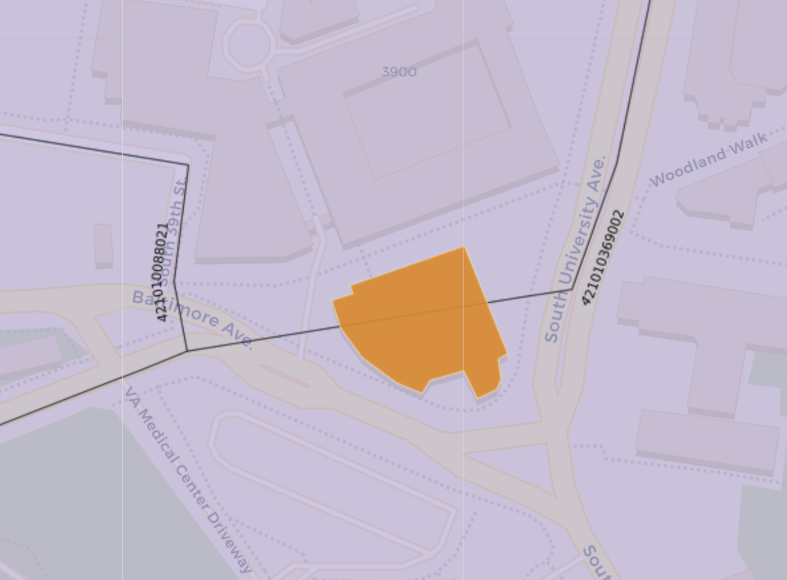

# Week 3 Lab - JOINs and more Spatial SQL

## Topics

1. GitHub Desktop workflow demo
2. Introduction to our datasets
3. JOINs
4. Spatial JOINs

## GitHub Desktop

If you're not comfortable with the command line, [GitHub Desktop](https://desktop.github.com/) is a good way to use GitHub.

Download here: https://desktop.github.com/

## Datasets

### 1. Census block groups of Philadelphia County

**Dataset link:** `https://raw.githubusercontent.com/MUSA-509/week-3-spatial-database-pt-2/master/data/philadelphia_cbgs_w_population.geojson`

This dataset contains polygon geometries for Philadelphia County (FIPS 42101). The data originally came from [TIGER/Line with Selected Demographic and Economic Data](https://www.census.gov/geographies/mapping-files/2010/geo/tiger-data.html) but reduced to only population, geoid, and geometry. The full dataset has hundreds of census variables.


Block Groups (per [US Census](https://www.census.gov/programs-surveys/geography/about/glossary.html#par_textimage_4))

> Block Groups (BGs) are statistical divisions of census tracts, are generally defined to contain between 600 and 3,000 people, and are used to present data and control block numbering.  A block group consists of clusters of blocks within the same census tract that have the same first digit of their four-digit census block number.  For example, blocks 3001, 3002, 3003, . . ., 3999 in census tract 1210.02 belong to BG 3 in that census tract.

The two most important columns in this dataset for us are:

* `geoid`: Census block group identifier; a concatenation of the current state Federal Information Processing Series (FIPS) code, county FIPS code, census tract code, and block group number
* `geometry`: Polygon geometries of the block groups

### 2. SafeGraph Neighborhood Patterns (see link on Canvas for download)

**Dataset link:** `https://canvas.upenn.edu/courses/1533813/files/88443879/download?download_frd=1`

More on [SafeGraph Neighborhood Patterns](https://docs.safegraph.com/docs/neighborhood-patterns-2020).

There's a lot to unpack here. First, notice that the dataset doesn't have explicit geospatial data. It has the Census Block Group ID, though. If only we could match that to a geometry...

Other columns we will use in class:

  * `median_dwell`: Median dwell time in minutes. Note that we are only including stops that have a dwell of at least 1 minute.
  * `distance_from_primary_daytime_location`: Median distance from device_daytime_areas traveled to the stopping point(s) within the area by devices from their device_daytime_area (of devices whose device_daytime_area we have identified) in meters.
  * `distance_from_home`: Median distance from home traveled to the stopping point(s) within the area by devices from their home area (of devices whose home area we have identified) in meters.
  * `raw_device_counts`: Number of unique devices in our panel that stopped in this area during the date range. This includes devices whose home area is the same as this area.
  * `raw_stop_counts`: Number of stops by devices in our panel to this area during the date range. A stop must have a minimum duration of 1 minute to be included. The count includes stops by devices whose home area is the same as this area.

We will explore the other attributes in future classes.

### 3. OpenStreetMap Building Footprints

We'll use this OSM file from last week too.

**Dataset link:** `https://raw.githubusercontent.com/MUSA-509/week-2-digging-into-databases/master/data/university_city_osm_buildings.geojson`

## JOINs

Our template for a relational JOIN is as follows:

```SQL
SELECT <columns>
FROM <table1>
JOIN <table2>
ON <matching condition>
```

For example, from our lecture we saw a join with Indego data that allows us to connect station information with the trip data:

```SQL
SELECT
  trips.start_station,
  trips.duration,
  trips.start_time,
  trips.end_time,
  stations.the_geom,
  stations.id,
  stations.name
FROM andyepenn.indego_trips_2020_q2 AS trips
JOIN andyepenn.indego_station_status AS stations
 ON trips.start_station = stations.id
```


**1. Write a query that matches the Census Block Group Polygons to the SafeGraph dataset**

What column can we use to match between the two tables?

In this query, have the following columns in the `SELECT`:
* From the block group dataset, select all of the columns. If you give this dataset an alias of `c`, you can select all of its columns with `c.*` in the `SELECT` clause.
* From the SafeGraph dataset:  `median_dwell`, `distance_from_primary_daytime_location`, `distance_from_home`, `raw_device_counts`, `raw_stop_counts`

```SQL
SELECT
    c.*,
    n.median_dwell,
    n.distance_from_primary_daytime_location,
    n.distance_from_home,
    n.raw_device_counts,
    n.raw_stop_counts
FROM
    andyepenn.philadelphia_cbgs_w_population as c
JOIN
    andyepenn.neighborhood_patterns_philadelphia as n
ON
    n.area = c.geoid
```

**NOTE**: If you get an error like `bigint` does not match type `text`, then make sure the data type of `area` and `geoid` is `text` (click on the vertical `...` drop down in the column name of the respective dataset). You could also cast each column in the `ON` using `n.area::text == c.geoid::text`. It's best to keep GEOIDs as text as they are identifiers and sometimes will have leading zeros that will be removed if they are converted to a number.


**2. Using your answer from the previous question, modify it to find the number of unique devices per square kilometer for each block group.**

_Remember that ST_Area(geography) returns an answer in square meters._

```SQL
SELECT
    c.*,
    n.median_dwell,
    n.distance_from_primary_daytime_location,
    n.distance_from_home,
    n.raw_device_counts,
    n.raw_stop_counts,
    ST_Area(c.the_geom::geography) / (1000 ^ 2) as area_of_cbgs_sq_km
FROM
    andyepenn.philadelphia_cbgs_w_population as c
JOIN
    andyepenn.neighborhood_patterns_philadelphia as n
ON
    n.area = c.geoid
```

**3. Include a new column in the previous query that is the raw device count per population.**

_You will need the PostgreSQL function [`nullif`](https://www.postgresql.org/docs/12/functions-conditional.html#FUNCTIONS-NULLIF) in the denominator. This function returns null if the first argument matches the second, and the value of the first argument otherwise. In this case, a null is returned if `colname` is 0: `nullif(colname, 0)`. This is useful to avoid division by zero problems._

```SQL
SELECT
    c.*,
    n.median_dwell,
    n.distance_from_primary_daytime_location,
    n.distance_from_home,
    n.raw_device_counts,
    n.raw_stop_counts,
    ST_Area(c.the_geom::geography) / (1000 ^ 2) as area_of_cbgs_sq_km,
    n.raw_device_counts::numeric / c.total_pop_2010::numeric as devices_per_pop
FROM
    andyepenn.philadelphia_cbgs_w_population as c
JOIN
    andyepenn.neighborhood_patterns_philadelphia as n
ON
    n.area = c.geoid
```

## Spatial Joins

Spatial JOINs are similar to standard joins but we explicitly use spatial information in the join matching condition. There are several PostGIS functions that return true/false values. Here is a sample:

* ST_DWithin - are geometries g1 and g2 within d distance of one another?
* ST_Intersects - do geometries g1 and g2 have any overlap?
* ST_Disjoint - do the geometries _not_ intersect?
* ST_Touches - do the geometry borders touch?
* ST_Equals - is geometry g1 equal to g2?

**4. Using the OSM buildings dataset from last week, find all census block groups that intersect with these buildings and count the number of buildings per block group.**

```SQL
SELECT
    c.cartodb_id, c.the_geom, c.geoid, c.total_pop_2010, count(osm.osm_id) as num_buildings
FROM
    andyepenn.philadelphia_cbgs_w_population as c
JOIN
    andyepenn.university_city_osm_buildings as osm
ON
    ST_Intersects(c.the_geom, osm.the_geom)
GROUP BY 1, 2, 3, 4
```

**NOTE:** If we didn't want to do a count, here we can add a distinct in the SELECT to avoid duplicate block groups as several buildings will intersect the same block group. This brings the number of intersected block groups down from 483 to 15. DISTINCT removes the duplicates.

If you want to put your data on a map, you will need to include `cartodb_id`, `the_geom`, and `the_geom_webmercator` in the outer-most SELECT.

For mapping:

```SQL
SELECT
    c.cartodb_id, c.the_geom, c.geoid, c.total_pop_2010, count(osm.osm_id) as num_buildings
FROM
    andyepenn.philadelphia_cbgs_w_population as c
JOIN
    andyepenn.university_city_osm_buildings as osm
ON
    ST_Intersects(c.the_geom, osm.the_geom)
GROUP BY 1, 2, 3, 4
```

**5. We're probably double counting some of the block groups because some of the buildings probably intersect more than one block group. Turn your buildings into points and then do the intersection.**

```SQL
SELECT
    c.cartodb_id, c.the_geom, c.geoid, c.total_pop_2010, count(osm.osm_id) as num_buildings
FROM
    andyepenn.philadelphia_cbgs_w_population as c
JOIN
    andyepenn.university_city_osm_buildings as osm
ON
    ST_Intersects(c.the_geom, ST_Centroid(osm.the_geom))
GROUP BY 1, 2, 3, 4
```

**6. NEW: Which building(s) are in more than one census block group?**

```SQL
SELECT * FROM andyepenn.university_city_osm_buildings
WHERE osm_id IN (
  SELECT
      osm.osm_id
  FROM
      andyepenn.philadelphia_cbgs_w_population as c
  JOIN
      andyepenn.university_city_osm_buildings as osm
  ON
      ST_Intersects(c.the_geom, osm.the_geom)
  GROUP BY 1
  HAVING count(c.geoid) > 1
  )
```


